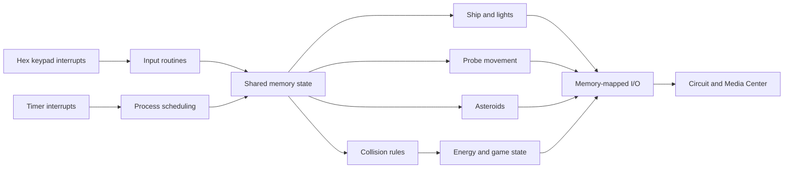

# Beyond Mars

> A real-time arcade game implemented in assembly with interrupts, concurrent processes, collision handling, audio, and animated media.

Beyond Mars is a low-level game built for a processor and circuit simulator.
The player controls a ship, launches probes, avoids asteroid collisions, and
manages energy while independent interrupt-driven processes update game state
and audiovisual feedback.

## Overview

The project turns computer-architecture concepts into a complete interactive
system. Assembly routines coordinate keypad input, timers, display updates,
moving entities, collision detection, energy state, animation, sound, and
game-over transitions through the simulator's memory-mapped interfaces.

It demonstrates low-level state management, interrupt handling, concurrent
process design, register discipline, memory-mapped I/O, and event-driven game
logic.

## Academic Context

This project was developed as part of the **Introduction to Computer
Architecture** course unit at **Instituto Superior Técnico, University of
Lisbon**.

This project explores low-level programming, assembly, processor architecture
concepts, memory management, and hardware-oriented reasoning.

## Key Features

- Real-time hexadecimal-keypad input scanning
- Concurrent processes driven by interrupts
- Energy management and display updates
- Multiple asteroid trajectories and collision rules
- Three player-launched probes
- Animated ship lighting
- Integrated backgrounds, overlays, audio, and video events
- Pause, restart, and game-over state handling

## Architecture



The main assembly program coordinates interrupt-driven routines through shared
memory state. Peripheral interaction stays at the simulator boundary through
memory-mapped circuit and media interfaces.

See [docs/ARCHITECTURE.md](docs/ARCHITECTURE.md) for the process map, event
flow, memory-state boundary, and simulator integration.

## Tech Stack

- Course assembly language and processor simulator
- Circuit and Media Center configuration
- Java-based simulator runtime
- Image, audio, and video assets

## Repository Structure

```text
.
|-- beyond-mars.asm             # Game logic and low-level routines
|-- beyond-mars.cir             # Circuit and Media Center configuration
|-- docs/                       # Architecture documentation
`-- sepe-simulator-1.5-2023.jar # Course simulator snapshot
```

The circuit file references the media used for backgrounds, overlays, sounds,
and video events.

## Getting Started

Prerequisite: a Java runtime compatible with the supplied simulator.

```bash
git clone https://github.com/jorgeflmendes/beyond-mars-assembly.git
cd beyond-mars-assembly
java -jar sepe-simulator-1.5-2023.jar
```

In the simulator:

1. Load `beyond-mars.cir`.
2. Confirm that the circuit points to `beyond-mars.asm`.
3. Start the simulation.

Controls:

| Key | Action |
| --- | --- |
| `C` | Start |
| `F` | Pause or resume |
| `E` | End game |
| `0` | Launch left probe |
| `1` | Launch center probe |
| `2` | Launch right probe |

## Running Tests

The project is validated interactively in the course simulator. It does not
currently include an automated test harness or CI workflow because execution
depends on the simulator, circuit, and media environment.

## Limitations

- Execution is coupled to the supplied course simulator.
- Hardware behavior and media integration are not portable to a native runtime.
- Automated headless testing is not currently available.
- Redistribution rights for the simulator and third-party media have not been
  independently established.

## Roadmap

- Add gameplay screenshots or a short recorded demonstration
- Document the main memory map and process interactions
- Separate first-party media from simulator-provided resources
- Add checksums and tested Java runtime information

## Usage Note

No blanket repository license is provided because the simulator and media may
be subject to separate rights. Review the applicable course and third-party
terms before redistribution or reuse.
