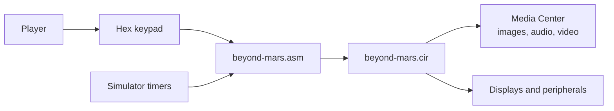
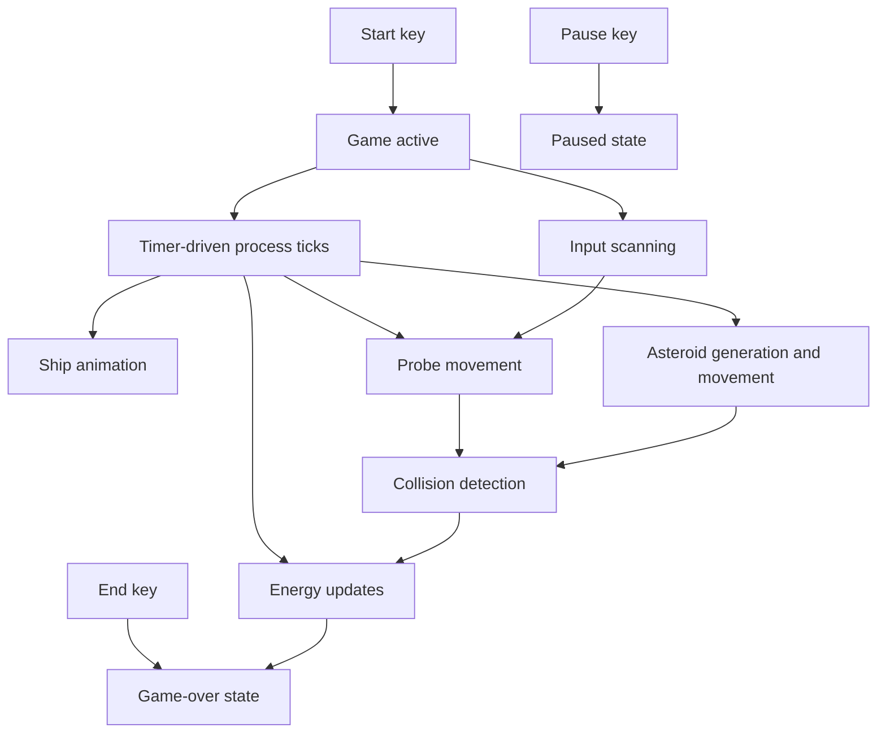
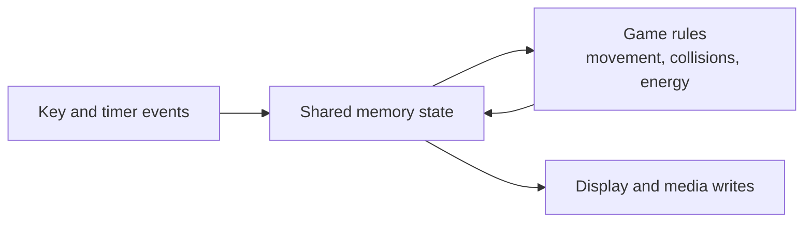
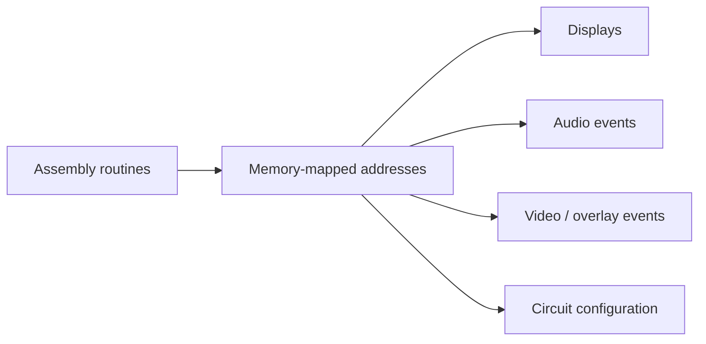

# Beyond Mars Architecture

This document describes the process, state, and simulator boundaries for the
assembly arcade game.

## System Context

The assembly program owns game behavior. The circuit file and simulator expose
the memory-mapped interfaces used for input, display, and media playback.

## Event and Process Flow

Independent routines cooperate through shared memory variables. The design is
event-driven: interrupts and key events update state, and rendering routines
project that state onto the simulator peripherals.

## State Boundary

The shared-memory boundary is the central architectural constraint. Routines
must preserve register discipline and update only the state they own.

## Component Responsibilities

| Area | Responsibility | Boundary |
| --- | --- | --- |
| Input routines | Decode start, pause, end, and probe-launch keys | Do not directly own game physics |
| Timer routines | Drive periodic updates for concurrent game processes | Avoid long blocking work |
| Ship routines | Animate ship lighting and player-facing state | Read game state, write display state |
| Probe routines | Launch and move up to three probes | Coordinate with collision checks |
| Asteroid routines | Generate trajectories and update positions | Respect active game state |
| Collision routines | Resolve probe, asteroid, and ship interactions | Feed energy and game-over state |
| Media routines | Trigger backgrounds, overlays, sound, and video | Stay behind simulator I/O addresses |

## Simulator Integration

Hardware behavior is simulator-defined. Portability to a native runtime would
require replacing the memory-mapped I/O layer and media configuration.

## Architectural Constraints

- Execution depends on the supplied Java simulator and circuit configuration.
- Automated headless testing is not currently available.
- Media and simulator redistribution rights are separate from the assembly
  source.
- The architecture prioritizes clear interrupt-driven behavior over portability.
